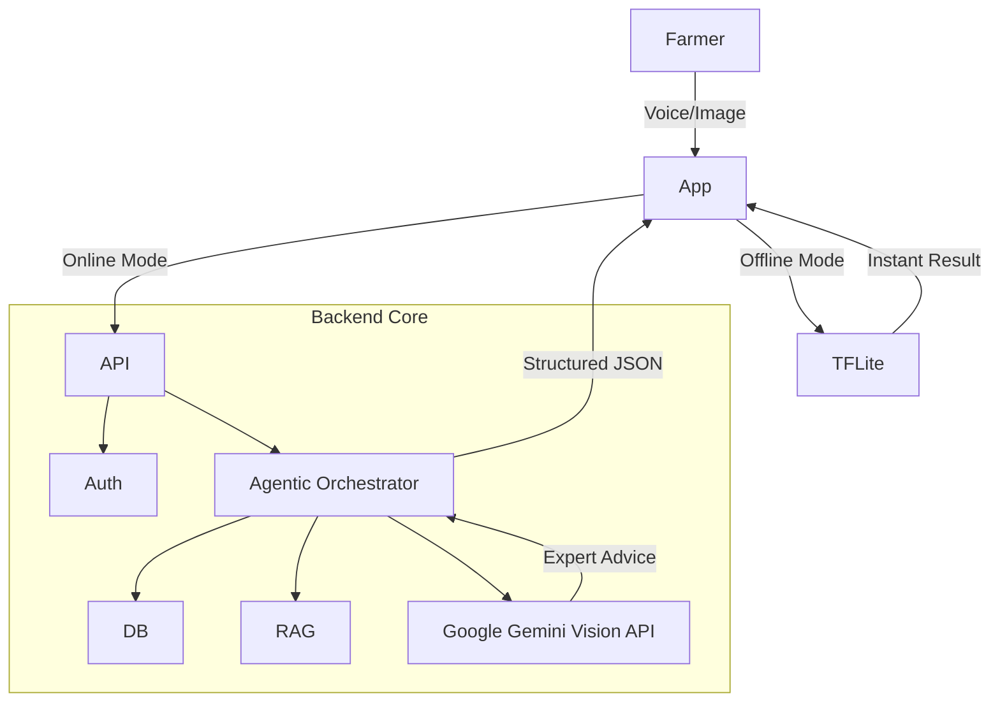

-----

# Ceres AI: The AI Agronomist for Kodagu 🌿☕

> **🏆 Winner: Best Problem Statement at HACKNOVA 1.0**

**Ceres AI** is a hyper-local, hybrid AI platform designed to empower the coffee and pepper growers of Kodagu (Coorg). It acts as an intelligent companion, bridging the gap between complex agronomy and the farmer's daily reality through instant diagnostics, voice-first interaction, and expert-level advice.

-----

## 🚀 The Problem

Farmers in the Western Ghats face unique challenges that generic apps fail to address:

  * **Hyper-Local Diseases:** Coffee Leaf Rust and Pepper Slow Decline manifest differently in Coorg's microclimate compared to Brazil or Vietnam.
  * **Connectivity:** Plantations often have little to no internet access.
  * **Language Barrier:** Vital scientific advice is often locked behind English PDFs, inaccessible to local growers who speak Kannada or Kodava Takk.

## 💡 The Solution: A Hybrid AI Engine

Ceres AI employs a two-tier architecture to ensure reliability and intelligence:

1.  **Tier 1: Instant Offline Diagnostics (Edge AI)** ⚡

      * Runs entirely on-device using a custom **TensorFlow Lite** model.
      * Instantly detects common threats (Rust, Leaf Blight, Spider Mites) without internet.
      * **Tech:** TensorFlow, MobileNetV2 (Quantized), Capacitor Plugin.

2.  **Tier 2: The "Detective" Agent (Cloud AI)** 🧠

      * When online, the app consults our backend agent.
      * **RAG Pipeline:** The agent reads authoritative documents (Coffee Board of India guides, KVK advisories) to ground its advice in local science.
      * **Gemini Vision:** Analyzes the image in the context of the specific farm's history and location.
      * **Tech:** FastAPI, Google Gemini Vision Pro, Vector Search (RAG).

-----

## 🛠️ Tech Stack

### **Backend (The Brain)**

  * **Framework:** Python FastAPI
  * **Database:** PostgreSQL (via Supabase) with SQLAlchemy ORM
  * **AI Orchestration:** Google Gemini 1.5 Flash
  * **Authentication:** JWT (JSON Web Tokens) with `passlib` encryption
  * **Knowledge Base:** Retrieval-Augmented Generation (RAG) using local `.txt` corpus

### **Frontend (The Interface)**

  * **Framework:** React.js / Vite
  * **Mobile Container:** Capacitor (for native Android/iOS build)
  * **Voice Interface:** Web Speech API & Capacitor Native Speech Plugin (Kannada Support)
  * **Offline AI:** `@tensorflow/tfjs-tflite` (WASM backend)

-----

## ⚡ Key Features

  * **📷 Hybrid Visual Diagnosis:** Seamlessly switches between offline TFLite models and online Gemini analysis based on network availability.
  * **🗣️ Voice-First Interface:** Full Speech-to-Text (SST) and Text-to-Speech (TTS) support in **Kannada**, making the app accessible to all farmers.
  * **📍 Dynamic Farm Memory:** The AI "remembers" specific farm details (Location, Crop Type, History), creating personalized, context-aware advice rather than generic answers.
  * **📚 Hyper-Local Knowledge:** Answers are grounded in the specific "Package of Practices" for the Kodagu region.

-----

## 🏗️ Architecture Overview



-----

## 🚀 Getting Started

### Prerequisites

  * Node.js & npm
  * Python 3.10+
  * Google Gemini API Key
  * Supabase Account (PostgreSQL)

### 1\. Backend Setup

```bash
# Navigate to backend
cd backend

# Create virtual env & activate
python -m venv venv
.\venv\Scripts\Activate.ps1  # Windows

# Install dependencies
pip install -r requirements.txt

# Configure Environment
# Create a.env file and add:
# DATABASE_URL="postgresql://..."
# SECRET_KEY="your_secret_key"
# GEMINI_API_KEY="your_gemini_key"

# Run Server
uvicorn main:app --reload
```

### 2\. Frontend Setup

```bash
# Navigate to frontend
cd frontend

# Install dependencies
npm install

# Run Web App
npm run dev
```

-----

## 🔮 Future Roadmap

  * **Kodava Takk Integration:** Developing a custom STT model for the indigenous language of Coorg.
  * **Market Intelligence:** Integrating real-time coffee prices from daily PDF reports via `tabula-py`.
  * **Community Forums:** A space for growers to share observations and alerts.

-----

